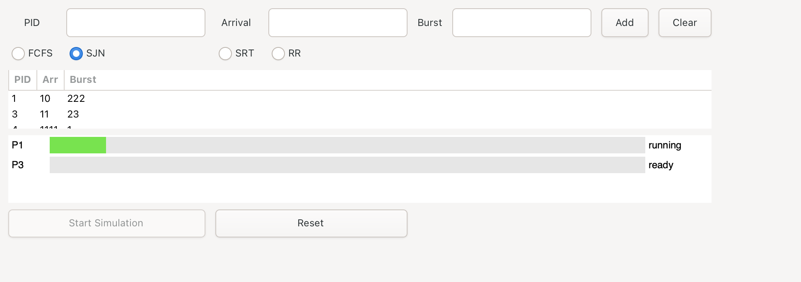

# CPU Scheduling Simulator (GTK4)

**SDT 302 - Assignment 2**  
*By Andrii Tivonenko & Oleksii Ishchenko*

## Introduction & Features
This application is a CPU Scheduling Simulator with a GTK4-based graphical interface. It helps users understand how various CPU scheduling algorithms behave by simulating process scheduling with a clean visual UI.

### Supported Scheduling Algorithms:
- First-Come, First-Serve (FCFS)
- Shortest Job Next (SJN)
- Shortest Remaining Time (SRT)
- Round Robin (RR)

### Main Features:
- Interactive GTK4 GUI
- Add and simulate custom processes
- Visual timeline of process execution

## How to Compile and Run

### Requirements:
- GTK4 development libraries
- GCC
- A Unix-like OS (Linux/macOS recommended)

### To Compile and Run:
1. Navigate to the project directory.
2. Open a terminal and run the compile script:
   ```bash
   ./compile.sh
   ```
3. This script will compile the source code and produce an executable file. You can then launch the application with:
   ```bash
   ./app
   ```

## Using the Application
1. **Start the Simulator**: Launch the program. The main interface should appear.
2. **Choose an Algorithm**: Select one of the following:
   - FCFS
   - SJN
   - SRT
   - Round Robin (configure time quantum)
3. **Add Processes**: Enter the process details:
   - Process ID/Name
   - Arrival Time
   - Burst Time
   
   Click **"Add Process"** to queue it.
4. **Run Simulation**: Click **"Start Simulation"** to begin.
5. **View Results**: The scheduling timeline and results will be displayed visually.

## Algorithms in Action

### 🔹 FCFS (First-Come, First-Serve)
- Non-preemptive
- Executes processes in the order they arrive
- Simple, but may cause long waits for short jobs

### 🔹 SJN (Shortest Job Next)
- Non-preemptive
- Picks the job with the shortest burst time
- Can lead to starvation for longer jobs

### 🔹 SRT (Shortest Remaining Time)
- Preemptive version of SJN
- Can interrupt a running job if a shorter one arrives
- More efficient, but complex logic

### 🔹 Round Robin
- Preemptive with time quantum
- Fair time-sharing model
- Each process gets CPU for a short slice (e.g., 2 seconds)

## Screenshots (Main window)

